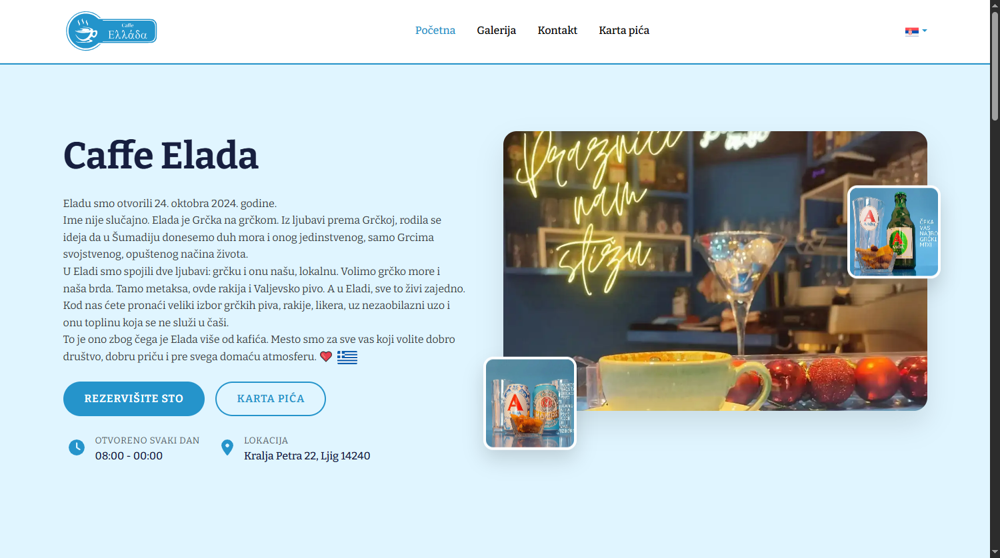
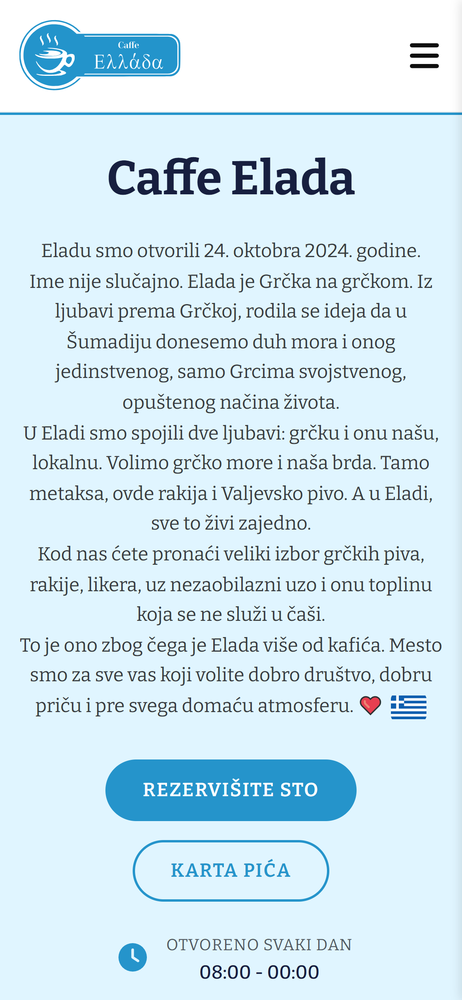

# ☕ Caffe Elada

> This repository is **public for portfolio and demonstration purposes only**. All rights reserved — see [License](https://github.com/crni99/caffe-elada/blob/main/LICENSE).

The **Caffe Elada** project is a unique demonstration of dual-implementation web development, maintaining two versions of the same café website:

- 🟦 **`main` branch** — a robust, component-based **Single Page Application (SPA)** built with **React**
- 🟨 **`vanilla` branch** — a clean, traditional **Multi-Page Static Site** built with **Vanilla JavaScript**

Both implementations are designed for a real, multi-lingual café website (Caffe Elada, Ljig, Serbia), featuring modern design libraries, PWA capabilities, and full support for **English, Serbian, and Greek**. This setup allows for a direct, side-by-side comparison between a lightweight static build and a dynamic, scalable component-based architecture — using the exact same design and content.

<br />

## ⭐ Live Demo

<table>
  <thead>
    <tr>
      <th>Application</th>
      <th>Platform</th>
      <th>Link</th>
    </tr>
  </thead>
  <tbody>
    <tr>
      <td>React SPA (Main)</td>
      <td>Primary Domain</td>
      <td><a href="https://caffeelada.rs/"><b>Launch Site 🡥</b></a></td>
    </tr>
    <tr>
      <td>React SPA (Mirror)</td>
      <td>Vercel (Subdomain)</td>
      <td><a href="https://caffe-elada.vercel.app/"><b>Launch Site 🡥</b></a></td>
    </tr>
    <tr>
      <td>Vanilla</td>
      <td>GitHub Pages</td>
      <td><a href="https://crni99.github.io/caffe-elada/"><b>Launch Site 🡥</b></a></td>
    </tr>
  </tbody>
</table>

<br />

## 📸 Screenshots

<table>
  <tr>
    <td align="center"><br/><sub>Desktop</sub></td>
    <td align="center"><br/><sub>Mobile</sub></td>
  </tr>
</table>

<br />

## ✨ Features

- 🌍 **Multi-language support** — English, Serbian, and Greek via `i18next` with automatic browser language detection
- 📱 **Progressive Web App (PWA)** — installable, with a service worker, web manifest, and app icons
- 🎨 **Modern, responsive UI** — built with Bootstrap 5 / React-Bootstrap, custom styling, and AOS scroll animations
- 🖼️ **Interactive gallery & lightbox** — powered by GLightbox
- 🍹 **Dynamic drinks menu & customer reviews** — data-driven components (`drinksData.js`, `reviewsData.js`)
- 🔍 **SEO-ready** — sitemap, robots.txt, JSON-LD structured data, and an `llms.txt` for AI/LLM discoverability
- 🔒 **Security-hardened deployment** — strict Content-Security-Policy, HSTS, X-Frame-Options, and other headers configured for both Vercel and Apache (`.htaccess`)
- 🔀 **Dual architecture** — identical design/content implemented as both a React SPA and a static Vanilla JS site, for direct comparison

<br />

## 🛠️ Tech Stack

| Category | Technology |
|---|---|
| **Framework** | React 19 |
| **Build Tool** | Vite |
| **Styling** | Bootstrap 5, React-Bootstrap, custom CSS |
| **Routing** | React Router DOM |
| **Internationalization** | i18next, react-i18next, i18next-browser-languagedetector |
| **Icons** | Font Awesome, flag-icons |
| **Animations** | AOS (Animate On Scroll) |
| **Gallery** | GLightbox |
| **Fonts** | Fontsource (Playfair Display) |
| **Deployment** | Vercel, GitHub Pages, GitLab/Bitbucket mirrors |
| **CI/CD** | GitHub Actions |

<br />

## 📁 Project Structure

```
caffe-elada/
├── public/                    # Static assets, images, manifest, service worker
├── src/
│   ├── assets/                # Logos, language flags
│   ├── components/            # React components (Header, Footer, Drinks, Gallery, Reviews, Contact...)
│   ├── context/               # LanguageContext
│   ├── hooks/                 # Custom hooks (e.g. useHashScroll)
│   ├── i18n/                  # i18next configuration
│   ├── locales/               # en / sr / gr translation files
│   └── pages/                 # Home, Drinks, NotFoundPage
├── vercel.json                # Vercel deployment & security headers config
└── .github/workflows/         # CI (build/test) and CD (Vercel, Pages, mirroring) pipelines
```

<br />

## ⚙️ Compatibility / Continuous Integration (CI) Checks

[](https://github.com/crni99/caffe-elada/actions/workflows/node.js.yml)

---

## ☁️ Deployment (CD) and Mirroring

[](https://github.com/crni99/caffe-elada/actions/workflows/vercel-deployment.yml)
[](https://github.com/crni99/caffe-elada/actions/workflows/pages/pages-build-deployment)
[](https://github.com/crni99/caffe-elada/actions/workflows/mirror-to-gitlab-and-bitbucket.yml)

The project is automatically built and tested on every push, deployed to **Vercel** (primary) and **GitHub Pages** (Vanilla build), and mirrored to **GitLab** and **Bitbucket** for redundancy.
